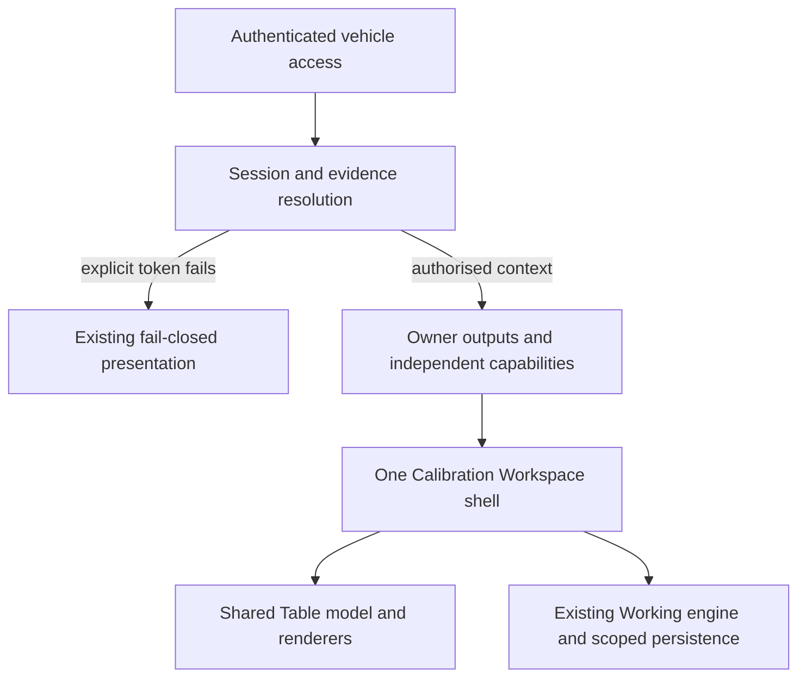

# Universal shell, evidence and identity

**RATIFIED ARCHITECTURE — IMPLEMENTATION REQUIRES SEPARATE FOUNDER AUTHORITY**

**Ratification:** [TS-RAT-024](../../07-engineering-governance-records/engineering-ratification-register.md#ts-rat-024) — Founder approval: 20 September 2026.

Part of the [ratified programme](README.md); all authority and status qualifications there apply. This is a presentation/application contract, not a new Engineering Domain.

## Shared shell and responsibility map

The application authenticates the actor, checks access to the vehicle and resolves session/evidence contracts before hydrating any saved workspace state. It composes owner outputs without qualifying them. Vehicle Identity owns identity/admission; Knowledge owns qualified Definitions and semantic assertions; Evidence owns acquired/materialised evidence within its contract; the accepted Calibration mutation and reconstruction engines retain their responsibilities. Presentation neither parses binary/XDF inputs nor recreates their authority.

This shell is the first bounded application of the [TuneSight-wide product invariant](README.md#universal-product-experience-invariant). Subscription entitlement may restrict entry or actions but never supplies engineering authority; Starter access and quotas remain undecided. Entitled tiers consume the same engineering truth and core shell.

| Stable location | Contents and behavior in every evidence state |
|---|---|
| Workspace header | Vehicle identity, exact calibration/Dataset identity and revision, evidence origin/status, Standard/Engineer switch, save status and limitations summary |
| Evidence strip | Reference/Stock, immutable Current, separate Working and reserved Suggested slots; selected layer, comparison availability, capability reasons |
| Engineering Navigation and Explorer | All Tables, Tuning Essentials, Systems, Changed/Evidence filters and search; explicit empty/unavailable state when no qualified Definitions exist |
| Tab strip | Exact Table instances, active selection, Working-change indicators; no route replacement when opening a Table |
| Main Table workspace | Shared Grid/2D/3D selector, slice/view controls and exact selected cells; honest missing/quarantined content in the same region |
| Cell Inspector | Exact identity, coordinates, Reference/Current/Working values, differences, authority and limitations |
| Inspector disclosures | Table Information, Raw Representation, Understand, Engineering Detail, Related Tables; all reachable in both modes |
| Working action region | Create/select Working, direct-edit/operation preview, validation, history, undo/redo and persistence status |
| Workspace controls | Explorer/Inspector collapse, restoration and Focus Workspace; capability/limitation details remain reachable |

Panel placement can adapt to available width; hierarchy, names, identities and command meaning cannot branch by engine family, DME, container or presence of Reference. Future professional context is an outer context selector, not a second shell. Suggested/Export/Flash reserve coherent evidence/action locations but do not become active buttons merely because the shell exists.

The explicit-token failure screen remains a pre-hydration boundary, not a Current-only layout or a recovered workspace. A future visual shell frame may surround that failure only under separate approval; it must not restore session data. No-token empty, missing Reference, quarantined or incomplete-semantic evidence otherwise occupies the universal shell.

## Evidence-slot matrix

| Slot/state | Meaning | Presentation / permitted use | Prohibited interpretation |
|---|---|---|---|
| Stock / Reference | Qualified source with explicit role and exact provenance; “Stock” only when that authority exists | Optional reference layer; keep role label and compatible comparison outcome | Original filename, candidate role or availability cannot prove factory stock or comparison compatibility |
| Current | Qualified immutable admitted calibration | Default baseline for Working; independent VIEW even without Reference | UI edit or upload ordering cannot mutate/reassign Current implicitly |
| Working | Sparse mutation history bound to exact Current/Dataset/Definition/layout revisions | Reuse accepted engine; changes and before/after visible | Not a new Current, exported image or installed tune |
| TuneSight Suggested | Distinct potential proposal with its own future evidence/authority | Reserved unavailable slot until independently authorised | Never fill with Working, guessed targets or recommendations |
| Missing Reference | Current may be fully qualified | Same shell; Reference and Current-versus-Reference delta unavailable with reason | Do not manufacture a baseline from zeros, another ROM or another vehicle |
| Missing Current | No qualified Current values | Same shell, identity/status and authorised upload workflow; no values or Working mutation | No Development Preview substitution, inferred bytes or “empty equals zero” |
| Quarantined Table/cells | Owner blocks affected evidence | Table remains discoverable with exact findings; isolate affected scope | No VIEW of quarantined engineering values, edits, interpolation across holes or reconstruction of blocked cells |
| Unresolved/conflicting evidence | Owner cannot establish a required contract | Keep established identity/metadata and unresolved/conflict reasons | No convenient winner or capability inferred by ordering |
| Operational read failure | Evidence could not be read | Distinct failure/retry status; preserve explicit-token boundary | Not evidence that the calibration does not exist |

Reference and Current may both exist without comparison authority. Show each only under its own VIEW authority; disable delta/overlay where the comparison contract is not qualified. A table-level quarantine does not discard other independently qualified Tables. Missing semantics does not remove qualified numerical VIEW.

## Capability matrix

Capability scope includes vehicle, exact Dataset/relationship and selected Definition/occurrence as applicable. A global badge must not imply every Table is eligible. The owner supplies state, reason, scope, authority revision, evidence/provenance and limitations; the shell displays rather than derives qualification.

| Capability | Required authority/dependencies | Failure at normal shell location |
|---|---|---|
| VIEW | Exact Definition applicability, representation and materialised qualified values | Discoverable metadata/status with unavailable Grid/plot values |
| EDIT | VIEW plus independent EDIT authority and engine validation | Read-only selection; edit controls disclose blockers; no mutation dispatched |
| RECONSTRUCT | EDIT plus exact source bytes/lease, layout, inverse/representation and reconstruction authority | Working remains reviewable; reconstruction unavailable with exact missing dependency |
| Export | Complete reconstruction plus checksum/integrity qualification and zero unexplained byte changes | Locked. Existing checksum-unknown outcomes remain visible; no download disguised as approved Export |
| Flash | Separately qualified transport, write, recovery and safety authority | Unavailable throughout this programme; no DME write path |

The envelope follows [TS-RAT-023](../10-vehicle-admission-independence.md). Authority, access permission and future entitlement are separate dimensions: execution requires all applicable dimensions; commercial access never makes a blocked capability qualified. Source-lease expiry disables reconstruction, not independently durable VIEW or Working history. Session expiry is a different boundary and cannot be bypassed by locally saved data. Retain current lease/session policies; this architecture changes no TTL.

## Identity and persistence ownership

Canonical context consists of authenticated owner scope, vehicle ID, source mode, session identity, Current Dataset ID/revision, ROM layout, relationship revision and Definition Set revision. A Table selection uses the existing Definition key plus revision and exact occurrence, bound to that Dataset context. A cell adds validated index/row/column. Titles, aliases, tab positions and numeric array offsets without this context are never identity.

| State | Proposed storage/ownership | URL / reload behavior |
|---|---|---|
| Vehicle identity | Server-authorised Vehicle Identity/access outputs | Vehicle route ID; reauthorise every entry |
| Dataset and Definition revisions | Governed immutable owner evidence, server materialisation | Resolve from authorised evidence; URL hints cannot override revisions |
| Session identity | Server-private persisted session, owner/vehicle-bound | Existing explicit `session` query; not an access grant; preserve accepted failure semantics |
| Selected Definition + occurrence | Presentation selection of exact admitted instance | Existing `definition` key when unambiguous; future revision/occurrence query hints must resolve exactly, never by title |
| Open tabs + active tab | Browser-local, versioned, owner/vehicle/Dataset/revision scoped UI snapshot | Restore only after authorised evidence, revalidate every tab; explicit URL selection takes precedence |
| Selected cell / region | Per-tab presentation state under exact identity | Browser-local snapshot; optional validated row/column deep link in later slice, never accept out-of-bounds coordinates |
| Grid/2D/3D and row/column slice | Per-tab browser-local presentation preference | Revalidate geometry on restore; unavailable view is disclosed, Grid can be selected without changing evidence |
| Standard/Engineer | Browser-local user preference initially; Founder-approved Standard default for a new user/profile | Remember an explicit selection across reload; no Dataset/session request; optional future account preference is not a new evidence contract |
| Collapsed panels | Browser-local preference scoped to user and display class | Restore actual geometry and labelled restoration controls |
| Focus Workspace | Session-scoped UI overlay | Remember within navigation session; do not persist forced Focus across a fresh browser session; exit restores explicit panel states |
| Current/Working display selection | Scoped presentation preference | Working selection only if exact history replays; otherwise explicitly unavailable, never create replacement history silently |
| Working mutations and undo/redo cursor | Existing browser-local Working store and replay validation | Durable on this browser across reload; scope/revision mismatch fails closed; not multi-device or staff-shared |
| Derived values, indexes, meshes and caches | Rebuildable consumers of owner output and validated Working state | No authority from cache; retain bounded caches; invalidate by revision |
| Future server revision history/notes/reviews | Mandatory future professional Workshop production gate under a separate governed programme | Browser store retained through U0–U6 unless separately authorised; no schema or server substitution authorised here |

Restoration order: authenticate/access-check; resolve explicit token or governed no-token recovery; resolve evidence and capability envelope; validate exact URL selection; replay compatible Working; validate stored tabs/cells; apply mode/layout preferences. If a Definition key is absent or ambiguous, show unresolved selection and the Explorer; do not choose a similarly titled Table. An ordinary first open without a Definition selection may use a deterministic available default, clearly distinct from resolving an invalid explicit selection.

No-token reopen can use the existing latest scoped session followed by explicit vehicle-role recovery. A supplied malformed, empty, repeated, invalid, unavailable, expired or wrong-owner/vehicle token can use neither recovery path nor preview. A read failure cannot hydrate stale local values. The accepted implementation remains [subscriberWorkshopEntry.ts](../../../lib/calibration-workshop/subscriberWorkshopEntry.ts).

Browser storage failure must show “not saved” without claiming durability; keep in-memory Working and avoid silent loss on navigation. Another window/revision must not silently overwrite a divergent history: detect a conflicting stored revision, suspend automatic overwrite and require an explicit future reconciliation workflow. This is a proposed persistence extension, not a claim that current storage already coordinates writers. Logout/account change clears hydrated state; caches are scoped and may never authorise access. No raw binary or source lease bytes enter UI preference storage.

## Responsive contract

Founder-approved device policy: desktop and laptop are the primary full Calibration editing surfaces, with a dominant Table, persistent tabs, adjustable/collapsible Explorer and Inspector, keyboard editing and contextual disclosures. Smaller laptops retain full editing through responsive collapse and Focus Workspace, with restoration controls inside the workspace; no invisible grid columns or dead rails.

Proposed review profiles are 1440×900 desktop, 1024×768 small laptop, 820×1180 tablet and 390×844 phone; these are acceptance fixtures, not final CSS breakpoints. Under the approved policy, tablet defaults to review; qualified editing may be enabled later only after explicit interaction and safety validation. Phone supports identity, evidence, capability status, exact-value inspection, history and read-only review. Full cell editing is unavailable on phone until separately designed and validated, with a display-suitability explanation. Display suitability may restrict an interaction without changing the underlying EDIT qualification.

Focus Workspace is available in both evidence states, suppresses side panels as an overlay and restores previous collapse states. Critical failure, validation and save status remain visible. Disclosure order and focus targets stay coherent for keyboard/screen-reader access. Color is supplementary: changed, blocked and warning states have text/shape cues.

## Provisional capacity and protected state

The existing 12-open-tab and six-derived-Table bounds may be retained during U0–U6 for regression safety and measured performance. They are provisional migration limits, not permanent professional product limits. Final capacity must be based on controlled performance measurement and professional workflow review; measured expansion or configurable professional capacity requires its own review.

TuneSight must never silently evict Working history. A Table with unapplied input, Working changes or relevant history must not be silently evicted. At capacity, present an explicit, understandable decision, such as cancelling the requested open or explicitly selecting an eligible tab to close, rather than unexplained removal. Closing a tab does not delete its Working history. Rebuildable derived-Table cache eviction may remain bounded only if it preserves tabs, pending input, selections, Working and history and faithfully rebuilds the exact Table. This protects user state without turning the cache bound into a second open-tab limit. Existing automatic tab eviction is baseline behavior to rectify in the authorised migration, not an exception to this target contract.
